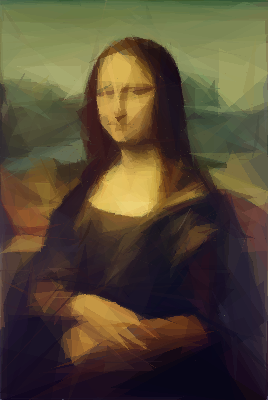
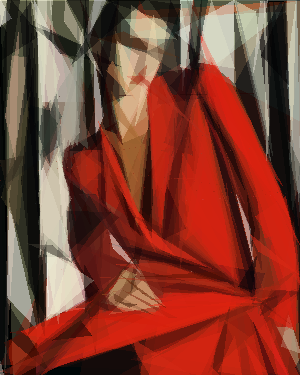
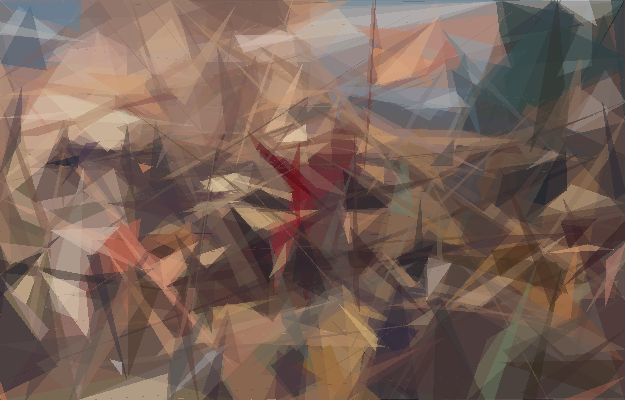

# Evolutionary Painting


### The following repository shows the results of my  work on the Evolutionary Algorithms Course Final Project

A program that uses a simple genetic algorithm to create similar images using triangles.

More details about project are available [here](https://github.com/trytrihjyuki/university/blob/genetic-painting/S3/EvolutionaryAlgorithms/genetic-painting/raport/raport.pdf) (PL only).

## Usage
Can be used in code by importing a class:
```python
from EvoPainting import Painter
```
or from command line:
```bash
python3 main.py input_image.jpg output_image
```

| Argument        | Description           |
|:---------------:|:-------------:|
|  -N --population      |  Population size. *Default* 1 |
|  -T --iterations      | Iterations of evolution. *Default* 10000    |  
| -m --max-obj-num | Maximum number of triangles in one infividual. *Default* 100    | 
|-c --number-children | Number of children of each individual *Default* 50 |

## Pictures
About 30 hours of painting (500 triangles):



About 7 hours of painting (200 triangles):


