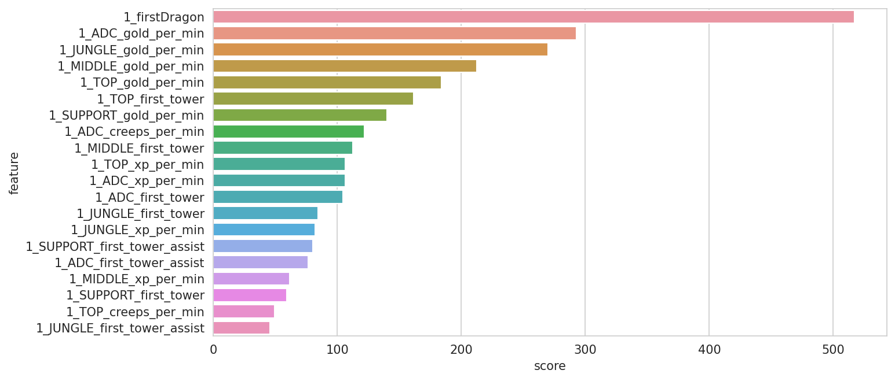

# How to win [League of Legends](https://en.wikipedia.org/wiki/League_of_Legends)?

### The following repository shows the results of our joint work on the Machine Learning Course Final Project

##### What is League of Legends?
From Wikipedia:
League of Legends is a 2009 multiplayer online battle arena video game developed and published by Riot Games.

##### Our goal
We wanted to create a model that would be able to judge the final result of the match from the match statistics from the 10th minute of the game, ava. As data, we used 90 features 45 per team.

The average length of a game in LoL is about 35 minutes, so we want to try to predict the result in less than 1/3 of the match!

##### Data collecting
We collected data using a hand-written Python class that creates datasets using the [API](https://developer.riotgames.com/) provided by Riot Games. More info about data collecting proccess [here](https://github.com/trytrihjyuki/university/tree/master/S3/MachineLearning/project/data_collecting).

#### Data
More info about our results and some plots [here](https://github.com/trytrihjyuki/university/blob/master/S3/MachineLearning/project/notebooks/lol-early-results-and-insights.ipynb)
#### Results
We got ~72% accuracy but more of our interesting conclusions and results can be found [here](https://github.com/trytrihjyuki/university/tree/master/S3/MachineLearning/project/notebooks)

