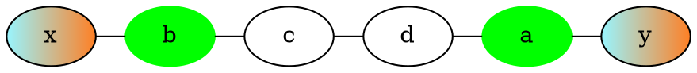
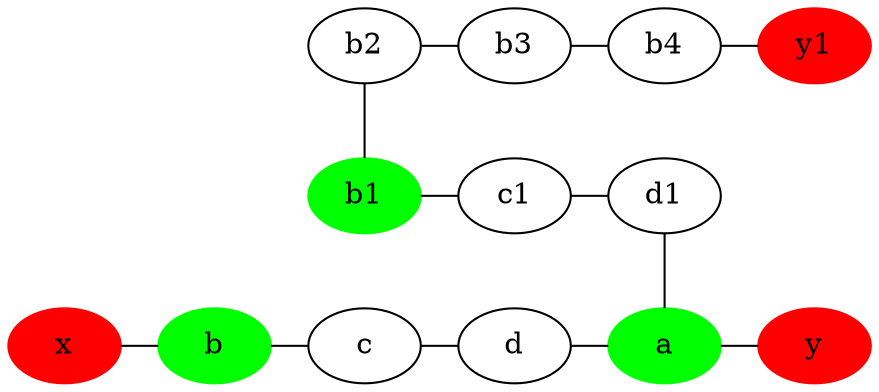
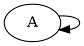
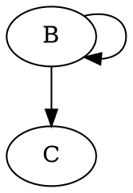
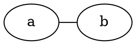
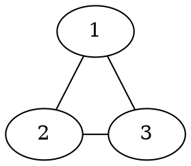

### Zadanie 2
$$
P_5(x,y) = (\exists a)(P_4(x,a) \land (\forall b)(P_3(b,a) \implies P_4(b,y)))
$$

### Zadanie 3
### 1.
Graf $G$:

Weźmy dowolny graf $G'$ i zauważmy, że funkcja $h: G' \rightarrow G$ taka, że dla każdego $v \in V(G')$ $h(v) = A$. Wtedy (ponieważ istnieje krawędź $A \rightarrow A$) $\forall v,w \in G' (v,w) \in G'(E) \implies (h(v),h(w)) \in G(E)$ czyli $G'$ jest homomorficzny do $G$. 

### 2.
Kontrprzykład:

graf $G_1$

graf $G_2$

$h_1: G_2 \rightarrow G_1$, z 1. mamy istnienie
$h_2: G_1 \rightarrow G_2$, taki że $h_2(A) = B$, a więc istnieje taki izomorfizm

Są *homomorficzne równoważnie*, ale mają różną ilość wierzchołków, więc nie są izomorficzne.

### Zadanie 4
Obserwacja: Każdy graf, który jest parzystym cyklem jest dwudzielny, więc jego zbiór wierzchołków możemy przedstawić jako: $V(G) = A \cup B$. 
Weźmy dowolne 2 grafy - cykle parzyste $G_1$ i $G_2$. Zauważmy, że w każdym z tych grafów istnieje podgraf postaci:

A więc homomorfizm $h:G_1 \rightarrow G_2$ moglibyśmy zdefiniować $h(v) = a$ jeśli $v \in A$, $h(v) = b$ jeśli $v \in B$. Wtedy (ponieważ graf jest dwudzielny i krawędzie są tylko między wierzchołkami z A i B) $\forall v,w \in G_1 (v,w) \in G_1(E) \implies (h(v),h(w)) \in G_2(E)$ czyli $G_1$ jest homomorficzny do $G_2$. Analogicznie możemy zbudować homomorfizm $h:G_2 \rightarrow G_1$.

### Zadanie 5

Niech $G_1 := G$ , a $G_2 := K_3$.
Zauważmy, że jeśli G nie jest 3-kolorowalny to istnieje taka para sąsiednich wierzchołków $v$ i $u$ taka, że $c(u) = c(v)$ czyli w naszym grafie $G_2$ musiałaby istnieć pętla przy którymś wierzchołku. Ale skoro jej nie mamy to $G$ jest 3-kolorowalny iff, gdy będziemy w stanie stworzyć homomorfizm przypisujący wierzchołkom różnych kolorów z G różne wierzchołki w $K_3$.

Zapisanie grafu G w bazie danch możemy zrobić liniowo względem liczby krawędzi.